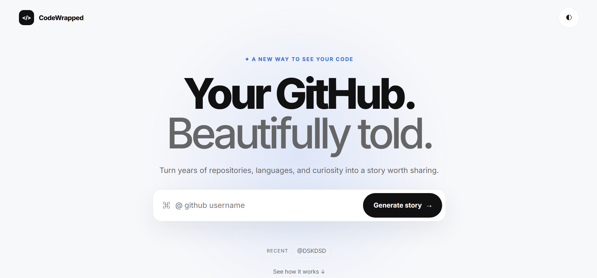

# CodeWrapped

> **Your GitHub. Beautifully told.**

Transform any public GitHub profile into a cinematic developer story using pure HTML, CSS, and Vanilla JavaScript.

## 📸 Preview

---

## ✨ Features

- Search any public GitHub profile
- Cinematic Developer Story
- Developer Archetype
- Coding DNA Analysis
- Power Score
- Repository Highlights
- Canvas Share Card
- PNG Export
- Light & Dark Theme
- Fully Responsive
- Local Storage Cache

## 🛠 Tech Stack

- HTML5
- CSS3
- Vanilla JavaScript (ES Modules)
- GitHub REST API
- Canvas API
- LocalStorage

## 🚀 Live Demo

**Website:** https://wrapmycode.netlify.app

## 🏆 Challenge

Built for the **Code With Affaq Coding Challenge** using only HTML, CSS, and Vanilla JavaScript.

No frameworks. No backend. No build tools.

## 📄 License

MIT License
